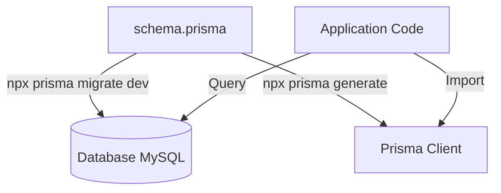

# Prisma Flow Documentation - Crawler Agents

Dokumentasi ini menjelaskan alur kerja (workflow) penggunaan Prisma ORM dalam proyek Crawler Agents untuk mengelola database MySQL.

## Alur Kerja Utama (Core Flow)

Berikut adalah diagram sederhana alur kerja Prisma:



### 1. Definisi Model (`schema.prisma`)
Semua struktur database didefinisikan di file `backend/prisma/schema.prisma`. File ini berisi:
- **Datasource**: Konfigurasi koneksi database (MySQL).
- **Generator**: Menentukan bahwa kita ingin menghasilkan `prisma-client-js`.
- **Models**: Definisi tabel seperti `User`, `Plan`, `Subscription`, `ApiKey`, dan `ApiLog`.

### 2. Sinkronisasi Database (Migration)
Setiap kali ada perubahan pada `schema.prisma`, jalankan perintah berikut untuk memperbarui database:

```bash
npx prisma migrate dev --name nama_perubahan_anda
```

Perintah ini akan:
1. Membuat file migrasi SQL baru di folder `prisma/migrations`.
2. Menjalankan migrasi tersebut ke database MySQL.
3. Menjalankan `npx prisma generate` secara otomatis.

### 3. Pembuatan Client (`generate`)
Prisma Client adalah query builder yang *type-safe* yang dihasilkan berdasarkan skema Anda. Jika Client belum tersedia atau skema berubah tanpa migrasi (misalnya setelah pull dari git), jalankan:

```bash
npx prisma generate
```

### 4. Inisialisasi dalam Kode
Prisma Client diinisialisasi sekali di `backend/src/utils/prisma.js` untuk digunakan di seluruh aplikasi:

```javascript
// src/utils/prisma.js
const { PrismaClient } = require('@prisma/client');
const prisma = new PrismaClient();
module.exports = prisma;
```

### 5. Penggunaan di Controller
Gunakan instance `prisma` untuk melakukan operasi CRUD. Contoh:

```javascript
const prisma = require('../utils/prisma');

// Mendapatkan semua user
const users = await prisma.user.findMany();

// Mencari user berdasarkan API Key
const user = await prisma.user.findUnique({
  where: { apiKey: 'some-key' }
});
```

---

## Fitur Tambahan

### Database Seeding
Untuk mengisi database dengan data awal (seperti paket harga/plans dan user admin), jalankan:

```bash
node prisma/seed.js
```
*Catatan: Pastikan DATABASE_URL sudah diatur di file .env.*

### Prisma Studio
Visualisasikan dan edit data secara langsung melalui antarmuka browser:

```bash
npx prisma studio
```

---

## Ringkasan Model Data

| Model | Deskripsi |
| :--- | :--- |
| **Source** | Menyimpan konfigurasi crawler dan selector untuk berbagai situs berita. |
| **User** | Data pengguna, termasuk username (email), password (hashed), dan role. |
| **Plan** | Paket langganan (Free, Pro, Enterprise) dengan batasan kuota request. |
| **Subscription** | Relasi antara User dan Plan, mencatat status aktif dan masa berlaku. |
| **ApiKey** | Kunci akses API yang dibuat oleh pengguna untuk autentikasi request. |
| **ApiLog** | Catatan setiap request yang dilakukan menggunakan API Key (logging & analytics). |
